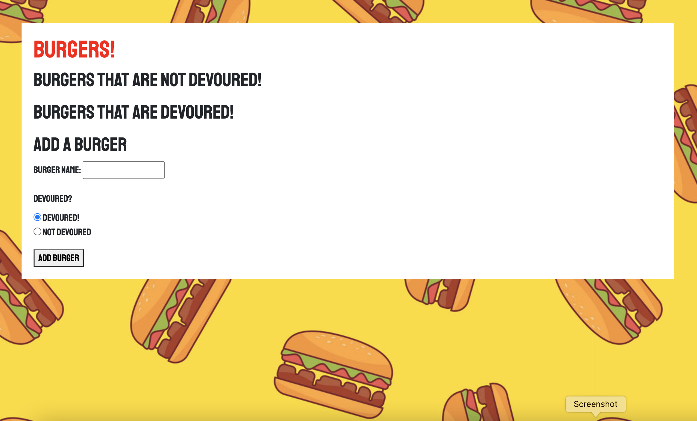
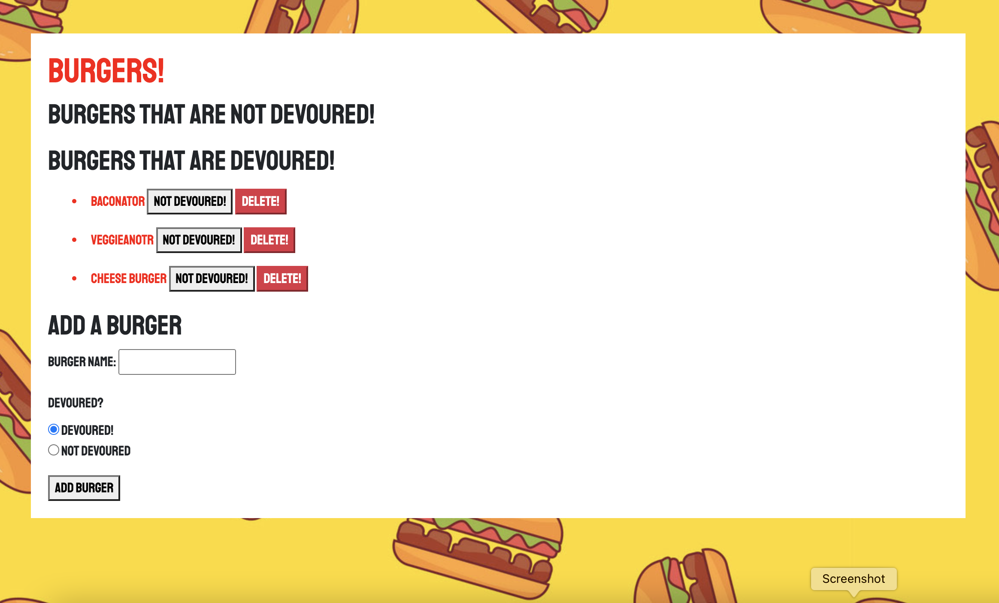
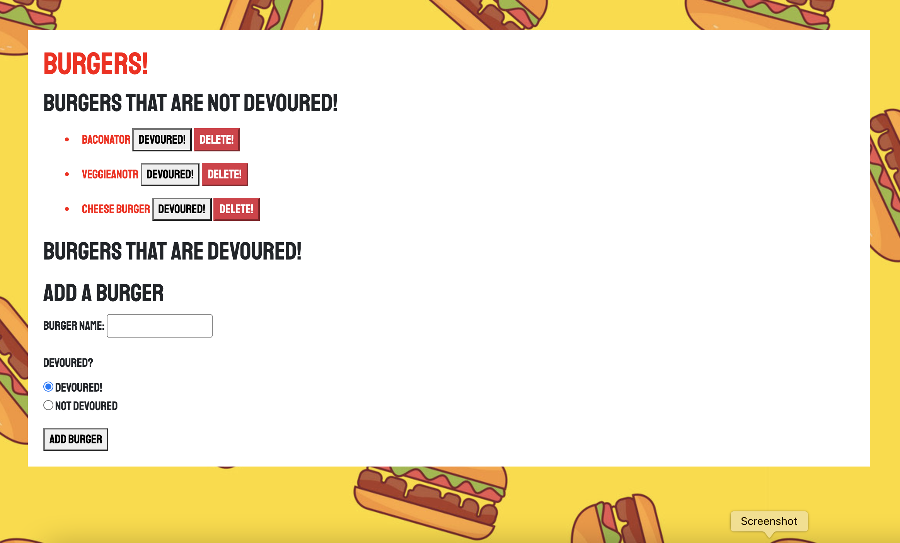
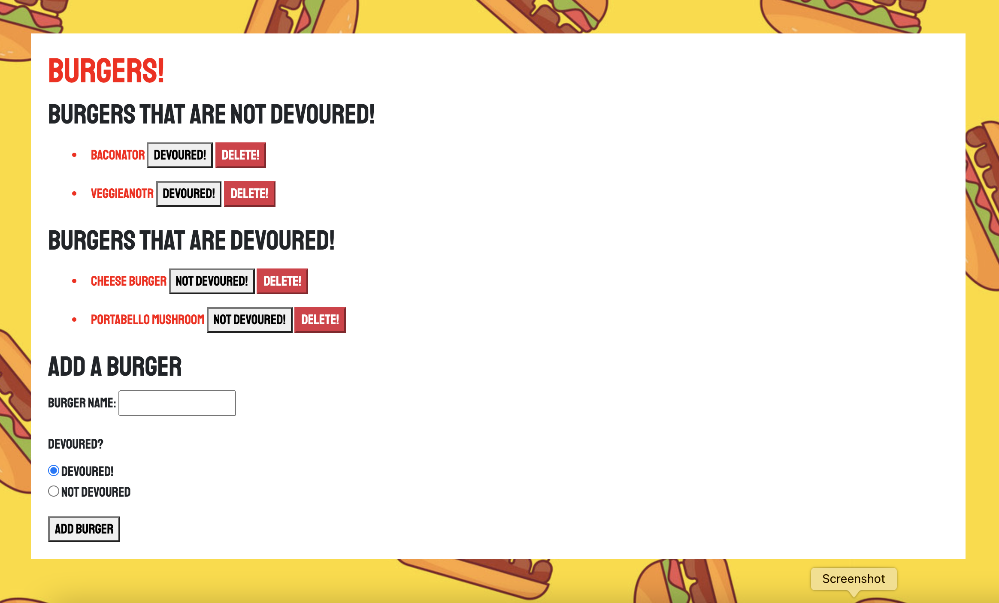

# Eat-da-burger-webpage

## Description
The project is a full-stack web application of a burger logger MySQL, Node, Express, Handlebars and a homemade ORM. 
## Table of Contents
* [Usage](#usage)
* [Screenshots](#screenshots)
* [Technologies-used](#technologies-used)

## Usage
The project has a to list of burgers that are devoured and those that are not. Those burgers can be deleted, devoured or not devoured and that will move them to their respected categories. The user also has the option to create their own burger and chose a option of devoured or not devoured.

## Technologies-used
Eat-da-burger uses handlebars/css and javascipt for the front-end as well as Node, Express and MySQL for the database.

## Screenshots

